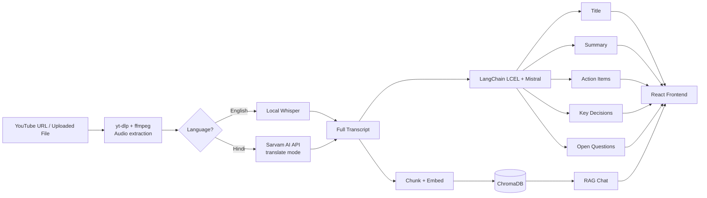

# VideoAgent — AI Meeting Assistant

VideoAgent turns any YouTube video or uploaded recording into a searchable, summarized, chat-ready meeting record. It transcribes audio (with dual-engine support for English and Hindi), summarizes it with an LLM, extracts action items and decisions, and lets you chat with the transcript using retrieval-augmented generation (RAG).

## Features

- **Flexible input** — paste a YouTube URL or upload a local audio/video file
- **Dual-engine transcription**
  - English audio → local Whisper (runs on-device, no API cost)
  - Hindi audio → [Sarvam AI](https://www.sarvam.ai/) (translates directly to English, tuned for Indian languages/accents)
- **LLM-powered analysis** via LangChain LCEL + Mistral:
  - Auto-generated meeting title
  - Map-reduce summary (handles long transcripts beyond a single context window)
  - Action items, key decisions, and open questions extracted separately
- **Chat with your meeting** — a RAG pipeline (ChromaDB + HuggingFace sentence embeddings) answers questions grounded only in the actual transcript, and says so honestly when it can't find an answer
- **Full-stack** — FastAPI backend + a single-file React frontend (no build step required)

## Architecture



## Tech stack

| Layer | Technology |
|---|---|
| Audio ingestion | `yt-dlp`, `pydub`, `ffmpeg` |
| Transcription | `openai-whisper` (local), Sarvam AI (`saaras:v3` API) |
| LLM orchestration | LangChain (LCEL), Mistral (`mistral-small-latest`) |
| Vector store / RAG | ChromaDB, HuggingFace `sentence-transformers/all-MiniLM-L6-v2` |
| Backend API | FastAPI, Uvicorn |
| Frontend | React (via CDN, no build step), vanilla CSS |

## Project structure

```
VideoAgent/
├── main.py                 # CLI entry point (terminal-based pipeline runner)
├── backend/
│   └── api.py               # FastAPI endpoints used by the React frontend
├── frontend/
│   └── index.html            # Single-file React UI
├── core/
│   ├── transcriber.py         # Whisper + Sarvam dual-engine transcription
│   ├── summarize.py           # Title + map-reduce summary (LCEL)
│   ├── extractor.py            # Action items / decisions / questions (LCEL)
│   ├── vector_store.py          # ChromaDB + embeddings
│   └── rag_engine.py             # RAG chat chain
├── utils/
│   └── audio_processor.py         # Download, convert, and chunk audio
├── requirements.txt
├── pyproject.toml            # uv build-dependency fix for openai-whisper
└── .env                     # API keys and model config (not committed)
```

## Setup

### 1. Clone and create a virtual environment

```bash
uv venv
.venv\Scripts\activate      # Windows
# source .venv/bin/activate  # macOS/Linux
```

### 2. Install dependencies

```bash
uv pip install -r requirements.txt
```

> **Note (Windows only):** `openai-whisper` requires `setuptools<82` at build time (newer `setuptools` removed the `pkg_resources` module it depends on). This is already handled via `pyproject.toml`'s `[tool.uv.extra-build-dependencies]`. If you hit a `pkg_resources` build error anyway, run:
> ```bash
> uv pip install "setuptools<82"
> uv pip install --no-build-isolation openai-whisper==20231117
> ```

### 3. Install FFmpeg

Whisper and `yt-dlp` both require the `ffmpeg` binary on your system PATH.

```bash
winget install ffmpeg      # Windows
# brew install ffmpeg       # macOS
```

### 4. Configure environment variables

Create a `.env` file in the project root:

```dotenv
MISTRAL_API_KEY=your_mistral_key
SARVAM_API_KEY=your_sarvam_key
WHISPER_MODEL=base
SARVAM_STT_MODEL=saaras:v3
```

### 5. Run it

**Option A — command line:**
```bash
python main.py
```

**Option B — web UI:**
```bash
# Terminal 1: start the backend
uvicorn backend.api:app --reload --port 8000

# Terminal 2: serve the frontend
cd frontend
python -m http.server 5500
```
Then open `http://localhost:5500` in your browser.

## How the RAG pipeline avoids hallucination

Each processed video gets its own isolated ChromaDB collection (keyed by a unique session ID). When you ask a question, the retriever only searches that video's chunks — never mixing content across different videos — and the LLM is instructed to answer only from retrieved context, explicitly saying "I could not find this information in the meeting transcript" when nothing relevant is found.

## Known limitations

- **Sessions are in-memory** — restarting the backend clears all active chat sessions (would need Redis or a database for production use)
- **Sarvam's REST endpoint caps audio at 30 seconds per request**, so longer chunks are split into pieces and transcribed concurrently, then stitched back together — this can occasionally lose a small amount of context at piece boundaries
- **No automated tests yet**
- **CPU-only Whisper transcription** is slower than GPU inference; `WHISPER_MODEL=base` trades some accuracy for speed on CPU-only machines

## Possible next steps

- Add automatic retries for transient API/network failures
- Persist sessions to a lightweight database instead of an in-memory dict
- Real-time progress streaming (Server-Sent Events/WebSockets) instead of a cosmetic step timer
- Switch to Sarvam's Batch API to avoid sub-chunking long Hindi audio
- Add unit tests for the transcription routing and RAG retrieval logic
